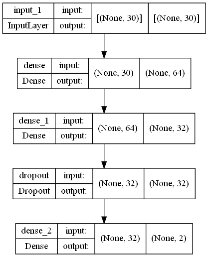
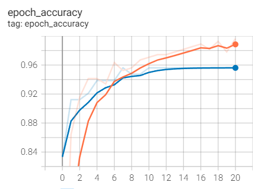
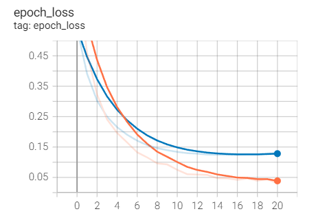

# Breast Cancer Prediction Using Feedforward Neural Network

## 1. Summary
This project aims to create a deep learning model which is able to accurately predict whether the breast cancer tissues are benign or malignant.

## 2. Methodology
### 2.1 IDE and Frameworks
This project was created using Spyder as the IDE. The frameworks used include Tensorflow Keras and Scikit-learn. Libraries such as numpy and pandas are also used in this project.

### 2.2 Data Source
The data used in this project is obtained from [Wisconsin Breast Cancer Dataset](https://www.kaggle.com/datasets/uciml/breast-cancer-wisconsin-data)

### 2.3 Data Pipeline
The data is first loaded and preprocessed to remove columns that are not useful. Then, the model is split into features and labels, and the labels are encoded using one-hot encoding. The data is then split into train-validation-test sets, where 20% of the data is allocated to the validation set, and the remaining data is split into train and test sets in a ratio of 60:40.

### 2.4 Model Pipeline
A feedforward neural network is constructed to solve this classification problem. The structure of the model constructed is shown in the figure below.

The model is trained with a batch size of 32 and 100 epochs. Early stopping is applied to the training, where it stops at epoch 20. The training process is shown in the figures below. An accuracy of 98% and validation accuracy of 95% is obtained. 

  

## 3. Results
The model is then evaluated using the test data prepared. The results obtained from the evaluation is shown in the figure below.

